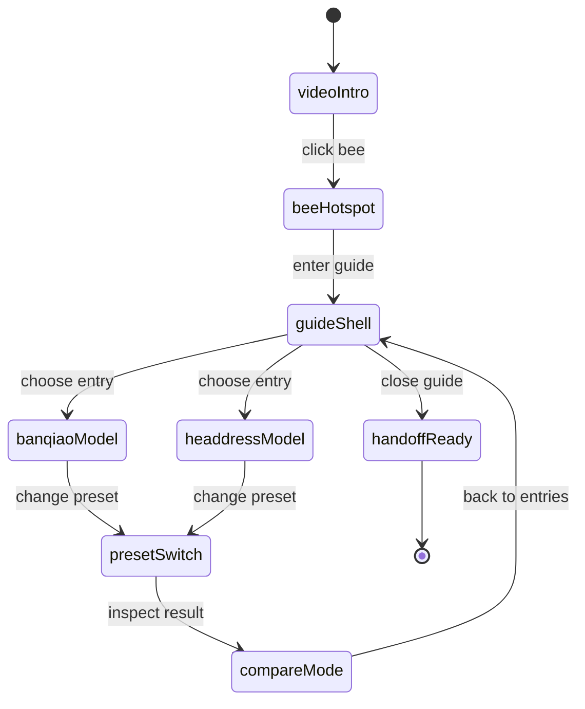
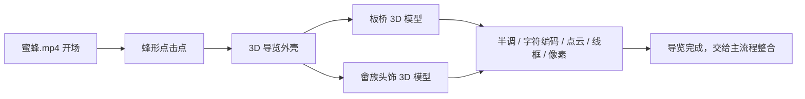

# banqiao-bee-3d-guide

## 2026-08-15 视觉更新

- 细化粒子与字符：粒子核心点提高不透明度与尺寸，字符取消发光模糊并提高对比度。
- 强化像素配色：palette 同时作用于模型自发光、全屏色带和扫描光层，确保换色可见。
- 新增 `模型原型 / Original` 预设：直接查看当前模型本体，不叠加数字艺术效果。
- 新增模型切换：保留 `base_basic_pbr.glb`，并加入 `1c94875422c97c3929a27501f34ba18d-web.glb`。
- 字符编码改为纯字符画输出：隐藏原始 Canvas 与装饰网格，只保留 ASCII 字符图案。
- 线框扫描加入 `Prism / Acid / Sunset` 三组多色 palette，颜色同时作用于模型线框与扫描层。
- 像素化加入 `Raster / Candy / Heat` 三组多色 palette，颜色同时作用于模型材质、分段色带和像素扫描层。
- 本轮仍为独立实验路由 `/lab/toushi-presets`，没有接入主流程，也没有修改纱线交互。
- 页面外壳改为项目“民艺标本剧场 + 田野影像日记”规范：纸页灰绿底、墨色文字、暗红索引线、档案式分栏；中央 3D 观察窗保留暗色数字实验空间。
- 参考 `output/imagegen/ke` 图像系列的纸张拼贴、半调网点、手绘轮廓、土黄与炭黑关系，在实验室外壳加入既有板桥房屋图像的低透明度证据层。
- 后续重构将 3D 观察窗改为米白纸面标本台，字符模式改为墨色印刷字符，模型与预设索引使用轻微撕纸边缘和纸张阴影，避免暗色科技控制台语言。

## 当前实现范围
本轮仅完成“畲族头饰 3D 模型 + 数字艺术风格预设”子模块。蜜蜂视频开场、板桥模型入口和双入口导览外壳仍保持为后续计划，不在本轮实现，也未接入主流程。

独立验收路由：`/lab/toushi-presets`

当前模型：
- 主模型：`public/assets/imagegen/banqiao-assets/toushi/base_basic_pbr.glb`
- 回退模型：`public/assets/imagegen/banqiao-assets/toushi/base_basic_shaded.glb`

当前预设：
- 半调：改为 three.js 官方 `HalftonePass` 后处理，使用用户给定的 Dot、radius 8.688、rotateR 25.47、rotateG 45、rotateB 29.999、scatter 0.39、greyscale、blending 0.8、Linear、disable 参数结构。
- 字符编码：保留模型结构，叠加字符网格和扫描反馈。
- 粒子云：模型表面粒子、稀疏外溢粒子、柔边发光与短拖尾共同构成动态粒子场。
- 线框扫描：线框材质、扫描层和冷色发光。
- 像素化：块尺寸、色度、拖影和量化参数。

当前验收图：
- `output/review/banqiao-bee-3d-guide/toushi-halftone-v7.png`
- `output/review/banqiao-bee-3d-guide/toushi-charcode-v7.png`
- `output/review/banqiao-bee-3d-guide/toushi-particle-v7.png`
- `output/review/banqiao-bee-3d-guide/toushi-wireframe-v7.png`
- `output/review/banqiao-bee-3d-guide/toushi-pixel-v7.png`

## 目标
这个独立组件负责把 Banqiao 段落从“视频引入”推进到“3D 导览入口”。开场必须使用现有视频 `public/assets/imagegen/banqiao-assets/蜜蜂.mp4`，用户点击蜜蜂后进入 3D 导览界面。

## 叙事作用
1. 先让用户记住蜂的移动和进入感。
2. 再把蜂变成导览入口，而不是装饰。
3. 最后把用户分流到两个文化模型，继续做数字艺术风格切换。

## 设计判断
阅读方式是：Banqiao 叙事中的独立导览组件，面向文化浏览者和研究型观看者，语言偏沉浸式，底色偏纸面和暗色，强调一个明确的蜂形入口和一个清晰的 3D 控制台。

## 定版素材
- 定稿开场素材：`public/assets/imagegen/banqiao-assets/蜜蜂.mp4`
- 定稿结构预览：`public/assets/components/banqiao-bee-3d-guide/overview.html`
- 定稿结构图：`public/assets/components/banqiao-bee-3d-guide/structure-board.svg`
- 定稿状态图：`public/assets/components/banqiao-bee-3d-guide/state-map.svg`
- 定稿转场提示：`public/assets/components/banqiao-bee-3d-guide/bee-to-guide-cue.svg`

## 参考素材
- `public/assets/models/banqiao/banqiao-diorama-v1.glb`
- `public/assets/models/banqiao/she-headdress-v1.glb`
- `public/assets/models/banqiao/rammed-earth-house-v1.glb`

这些模型文件当前可以视为后续整合目标，不要求本次已经存在。

## 组件结构
### 1. 开场层
- 全屏视频开场，视频上叠一个蜂形点击点。
- 视觉焦点只保留一个蜂入口，不放按钮墙。
- 点击后，开场层收起，导览层展开。

### 2. 导览层
- 顶部：短标题和当前模式提示。
- 左侧：两个入口卡片。
  - 板桥 3D 模型
  - 畲族头饰 3D 模型
- 中央：3D 视窗，负责旋转、缩放、查看。
- 底部：数字艺术风格预设条。
- 右侧或角落：当前模型说明与状态摘要。

### 3. 风格层
每个模型都支持同一组预设切换：
- 半调
- 字符编码
- 数字点云
- 线框扫描
- 像素化

预设只替换视觉层，不改变模型入口结构。

## 效果图说明
### 开场
- 视频铺满。
- 蜂是唯一可点击对象。
- 点击反馈偏轻，不做夸张弹窗。

### 导览
- 3D 视窗居中。
- 两个入口保持并列，但只允许一个激活。
- 预设切换时，模型轮廓和材质一起变化。
- 风格变化应明显，但不抢过模型本体。

### 转场
- 从开场到导览只做一次明确推进。
- 蜂飞行轨迹可以作为视觉引导线。
- 不在转场里加入新的叙事角色。

## 状态图

## 结构图

## 禁止新增元素
- 不修改现有纱线交互。
- 不把导览做成普通图文列表。
- 不额外增加第三个文化模型。
- 不在开场里加导航栏或多按钮菜单。
- 不把数字艺术预设做成独立页面。

## 验收点
- 视频来自 `蜜蜂.mp4`，不是替换素材。
- 点击蜂后能进入导览层。
- 两个入口都能看到。
- 五个预设都能被识别。
- 组件不直接接入主流程，只输出交接包。

## 交接说明
这个组件先作为独立包交给主对话，后续再由主对话决定如何接入现有 Banqiao 路由与 3D 资源管线。
